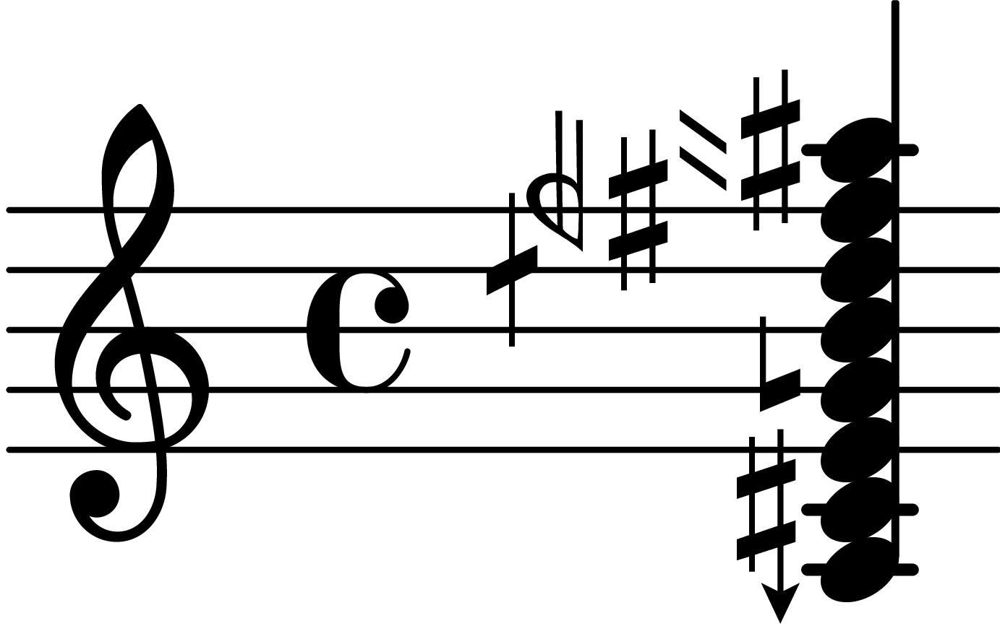

# heji-ly
**NOTE: This package is under active development and should be considered experimental.**

This [LilyPond](https://lilypond.org/index.html) package implements support for the [Helmholtz-Ellis Just Intonation](https://masa.plainsound.org/pdfs/notation.pdf) notation system. All standard accidentals (47-limit as of the time of writing) are supported and they can be combined in arbitrary ways through a general interface.

## Table of Contents
<!-- TOC start (generated with https://github.com/derlin/bitdowntoc) -->

- [heji-ly](#heji-ly)
  - [Table of Contents](#table-of-contents)
  - [Dependencies](#dependencies)
  - [Usage](#usage)
    - [HEJI scores and staves](#heji-scores-and-staves)
    - [The \\ji function](#the-ji-function)
    - [Chords](#chords)
    - [Playback](#playback)
  - [Options](#options)

<!-- TOC end -->

## Dependencies
The *HEJI2* font must be installed, which can be downloaded from [https://www.plainsound.org/](https://www.plainsound.org/). After downloading, just place it wherever LilyPond expects to find fonts on your system.

## Usage
To use this package in your project simply include the line

```lilypond
\include "/path/to/heji.ily"
```
### HEJI scores and staves
Music that uses HEJI accidentals should be placed in a `\HejiScore` block instead of a `\score` context, and inside these blocks use `\HejiStaff` instead of `\new Staff`. Currently, their only purpose is to ensure LilyPond properly renders the score to a MIDI file when the `heji-ly-render-midi` option is set (see [Options](#options)), but do not rely on this as it may be necessary to expand their function in the future.  

### The \ji function
HEJI accidentals can be added to a note by writing `\ji <factor string> <note>`

The syntax for factor strings is specified by the following grammar:

```
factor string = '"', factor *, '"' ;

factor = otonal factor
| utonal factor ;

otonal factor = [ 'o' ], prime factor ;

utonal factor = 'u', prime factor ;

prime factor = prime, [ exponent ] ;

prime = ? prime number ? ;

exponent = '^', nat ;

nat = ? natural number ? ;
```

In plain English: A list of prime numbers optionally raised to some power ("x^a y^b ...") which we call a *factor*. Factors can be prefaced by the letters 'o' or 'u' to specify otonal and utonal factors respectively. A factor by itself is interpreted as otonal. Whitespace is only necessary to differentiate different numbers and can otherwise be omitted.

Examples of well-formed strings:

```
""
"o3"
"u5"
"7^0"
"11"
"3 5"
"7o11"
"o13^1u17"
```

More examples can be found in the `examples` folder.

Accidentals can be combined in arbitrary ways:

```lilypond
\version "2.24.1"

\include "heji.ily"

\HejiScore {
  \HejiStaff {
    \relative a {
      \ji"3 5 7 11 13 17 19 23 29 31 37 41 43 47"a
    }
  }
}
```


The order of factors does not matter:

```lilypond
\version "2.24.1"

\include "heji.ily"

\HejiScore {
  \HejiStaff {
    \relative a {
      \ji"3 7 u11"a
    }
  }
}
```


```lilypond
\version "2.24.1"

\include "heji.ily"

\HejiScore {
  \HejiStaff {
    \relative a {
      \ji"u11 7 3"a
    }
  }
}
```


If there are repeated factors the exponents will be summed up:

```lilypond
\version "2.24.1"

\include "heji.ily"

\HejiScore {
  \HejiStaff {
    \relative a {
      \ji"u3 u5^3 u5^2 u3^2 u5 3^2 u3 5^4 5^2 3^2"a
    }
  }
}
```


### Chords
Chords can be input in exactly the same way:

```lilypond
\version "2.24.1"

\include "heji.ily"

\HejiScore {
  \HejiStaff {
    \relative a {
      <a \ji"3u5"c e \ji"u7"g b \ji"11"d \ji"3 u13"f \ji"3u17"a>
    }
  }
}
```



### Playback
Playback is only supported up to 16 simulatenous notes due to a limitation of MIDI. In order to support playback each note needs to be in its own channel and MIDI unfortunately only supports 16.

To render the previous example to a midi file we set the `heji-ly-render-midi` option to `#t`:

```lilypond
heji-ly-render-midi = ##t

\HejiScore {
  \HejiStaff {
    \set Staff.midiInstrument = "clarinet"

    \relative a {
      <a \ji"3u5"c e \ji"u7"g b \ji"11"d \ji"3 u13"f \ji"3u17"a>1
    }
  }
}
```

https://github.com/BridgeTheMasterBuilder/heji-ly/assets/71600489/05eacfed-58d7-4f15-affb-e1f08372d611

## Options

Options are set by assigning a value to variables, e.g.:

```lilypond
heji-ly-render-midi = ##t
```

Currently supported options:
- `heji-ly-heji-font` = <string> - Filename of the HEJI2 font on your system, excluding the file extension. Default: `"HEJI2"`
- `heji-ly-warn-on-empty-factors` = Whether to issue a warning when no factors are supplied to the `\ji` function. Default: `#t`
- `heji-ly-skip-validation` - Whether to skip validation of factors. Normally, factors are checked to make sure that only prime number factors appear in the list and that the exponents do not exceed the maximum supported value. Only set to `#t` if you're generating LilyPond code and can guarantee the factors are legal and want to squeeze some extra performance. Default: `#f`
- `heji-ly-warn-on-ill-formed-factor-string` - The factor parser is extremely lenient; it will ignore any unexpected characters and continue parsing. Set to `#t` if you wish to be warned about these unexpected characters. Default: `#f`
- `heji-ly-render-midi` - Set to `#t` if you want a rendered MIDI file. No need for `\midi {}` blocks, just set to `#t` and LilyPond will produce a MIDI file as well as a PDF score. Default: `#f`
- `heji-ly-reference-pitch` - The reference pitch to use (only affects MIDI playback). Default: `5` (A)