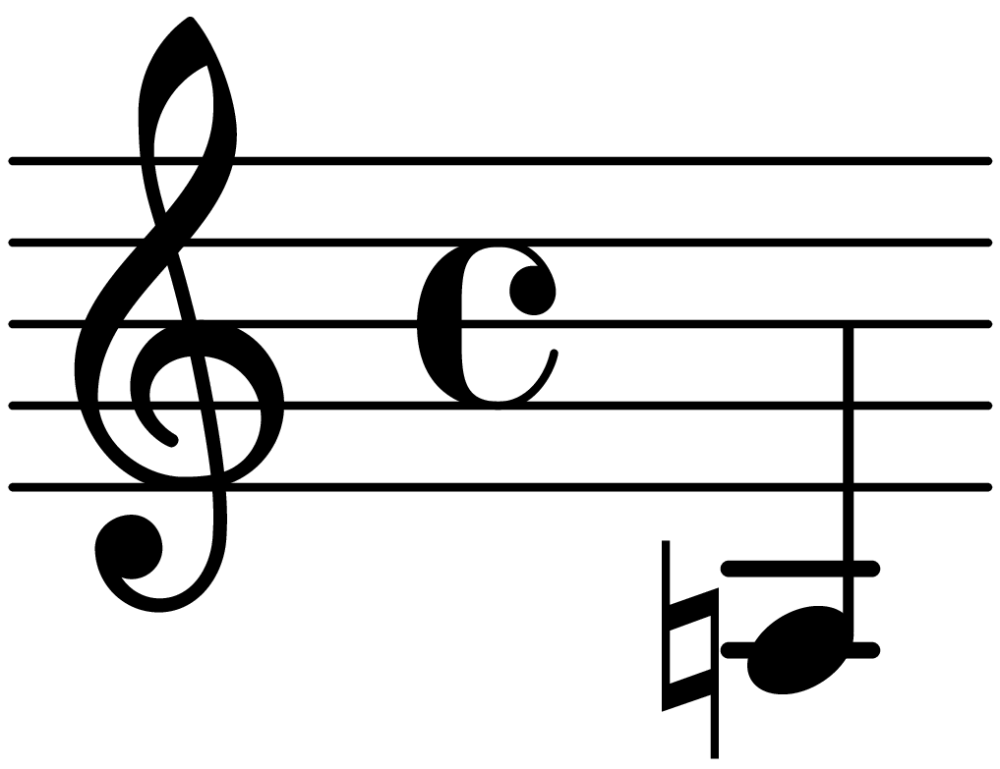

# heji-ly
This [LilyPond](https://lilypond.org/index.html) package implements support for the [Helmholtz-Ellis Just Intonation](https://masa.plainsound.org/pdfs/notation.pdf) notation system. All standard accidentals (47-limit as of the time of writing) are supported and they can be combined in arbitrary ways through a general interface.

## Dependencies
The *HEJI2* font must be installed, which can be downloaded from [https://www.plainsound.org/](https://www.plainsound.org/). After downloading, just place it wherever LilyPond expects to find fonts on your system.

## Usage
To use this package in your project simply include the line 

```lilypond
\include "/path/to/heji.ily"
```
### HEJI blocks
Music that uses HEJI accidentals should be placed in a `\heji` block, which ensures that accidentals are always printed properly:

```lilypond
\version "2.24.1"

\include "heji.ily"

\score {
  \new Staff {
    \relative a {
      \heji {
        \ji "5" a
      }
    }
  }
}
```


compare to:

```lilypond
\version "2.24.1"

\include "heji.ily"

\score {
  \new Staff {
    \relative a {
        \ji "5" a
    }
  }
}
```


### The \ji function
HEJI accidentals can be added to a note by writing `\ji <factor string> <note>`

The syntax for factor strings is specified by the following grammar:

```
factor string = '"', factor *, '"' ;

factor = otonal factor
       | utonal factor ;

otonal factor = [ 'o' ], prime factor ;

utonal factor = 'u', prime factor ;

prime factor = prime, [ exponent ] ; 

prime = ? prime number ? ;

exponent = '^', nat ;

nat = ? natural number ? ;
```

Examples of well-formed strings:

```
""
"o3"
"u5"
"7^0"
"11"
"3 5"
"7o11"
"o13^1u17"
```

More examples can be found in the `examples` folder.

Accidentals can be combined in arbitrary ways:

```lilypond
\version "2.24.1"

\include "heji.ily"

\score {
  \new Staff {
    \relative a {
      \heji {
        \ji "3 5 7 11 13 17 19 23 29 31 37 41 43 47" a
      }
    }
  }
}
```


The order of factors does not matter:

```lilypond
\version "2.24.1"

\include "heji.ily"

\score {
  \new Staff {
    \relative a {
      \heji {
        \ji "3 7 u11" a
      }
    }
  }
}
```


```lilypond
\version "2.24.1"

\include "heji.ily"

\score {
  \new Staff {
    \relative a {
      \heji {
        \ji "u11 7 3" a
      }
    }
  }
}
```


If there are repeated factors the exponents will be summed up:

```lilypond
\version "2.24.1"

\include "heji.ily"

\score {
  \new Staff {
    \relative a {
      \heji {
        \ji "u3 u5^3 u5^2 u3^2 u5 3^2 u3 5^4 5^2 3^2" a
      }
    }
  }
}
```



## TODO
- [ ] Accidentals in chords
- [ ] Playback (some initial progress in the `playback` branch)